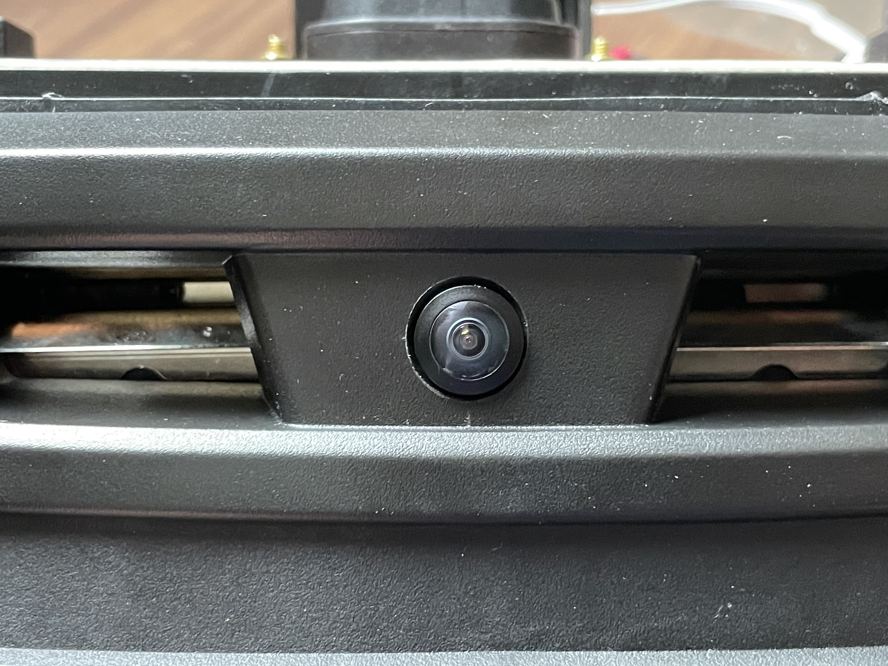
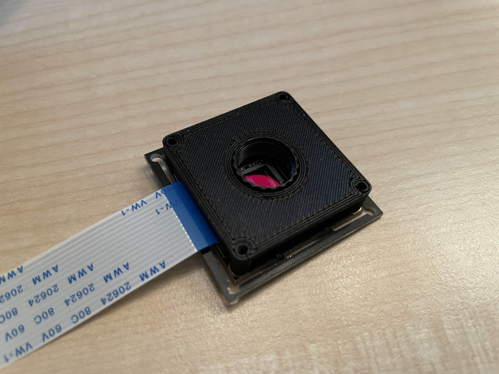
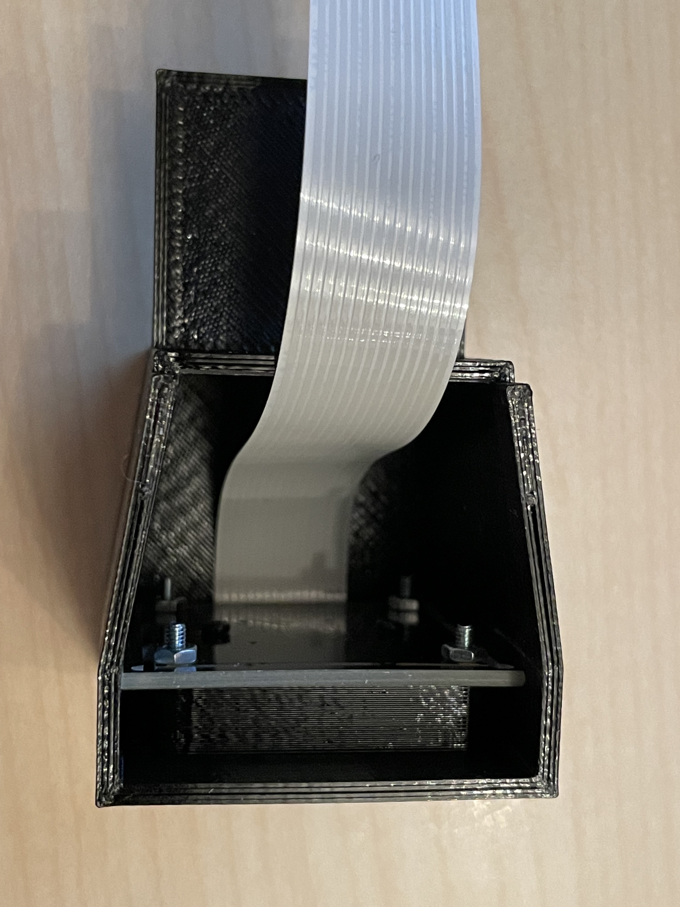
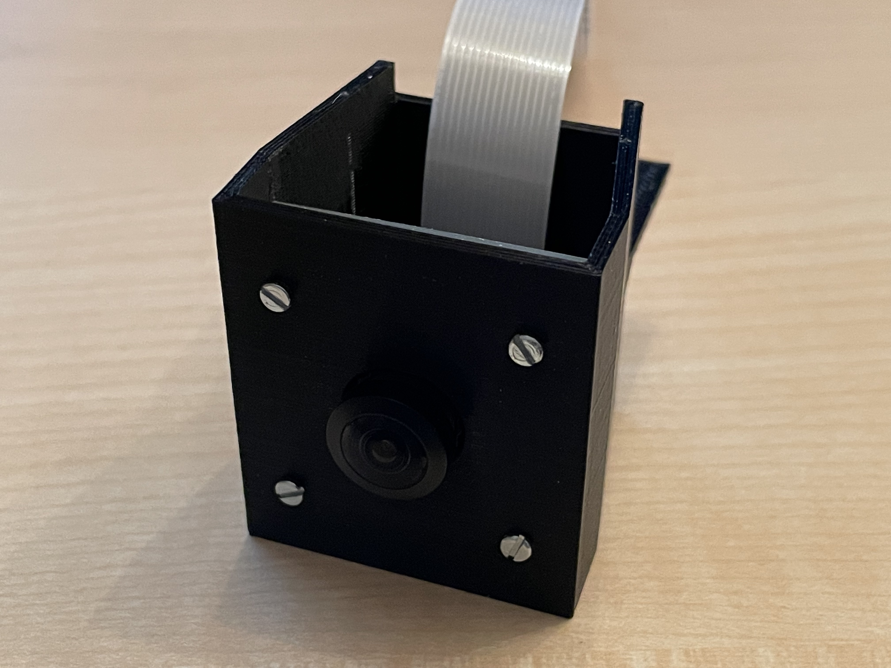
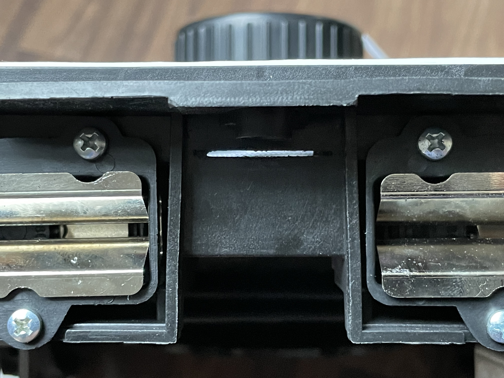
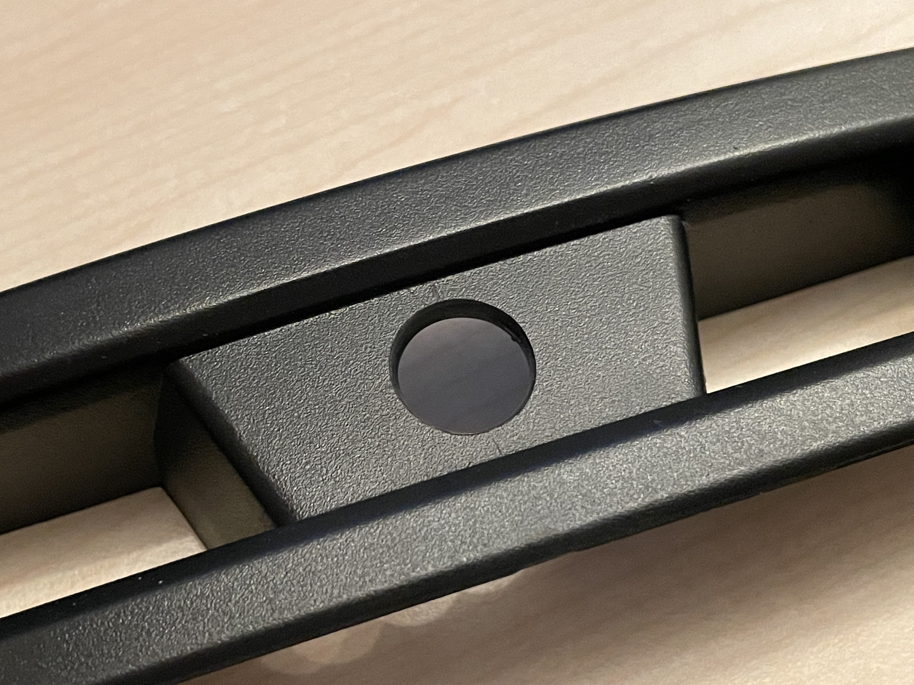
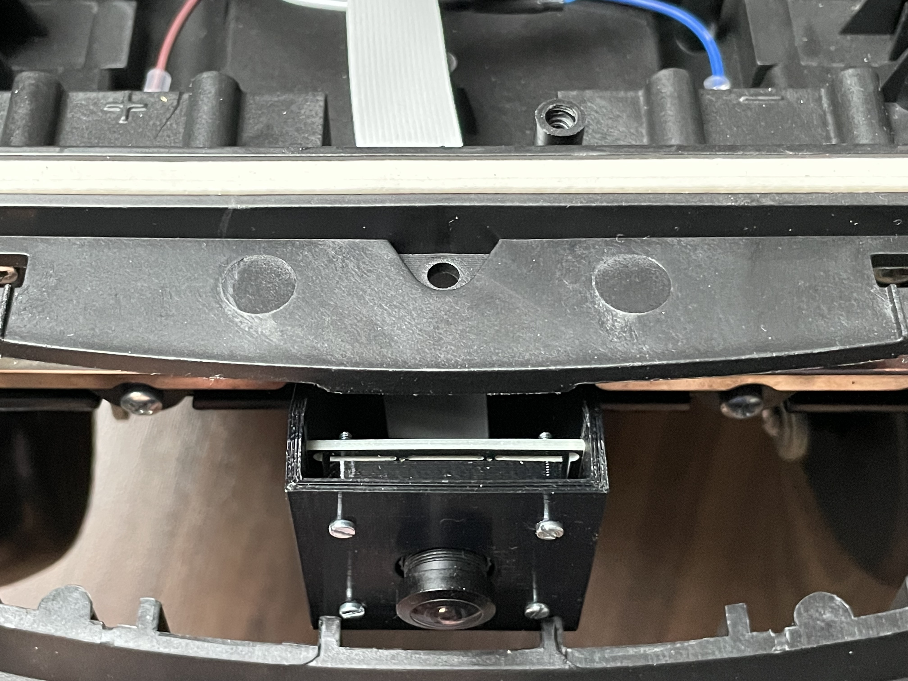

## Cam mount (alternative with bigger cam module)

## Assembly

Used camera was: https://www.amazon.de/gp/product/B074W6TPHF 
(don't forget to additionally purchase a ~50cm camera cable as the one that comes with the camera is just 15cm. I used this one: https://www.amazon.de/gp/product/B01MU2HAOM)

You will need a Dremel tool to slit the case to allow the flat cable to pass through and a 14mm drill for the camera lens to fit through the insert. To mount the camera with the insert to the mount you'll need some M2x14 screws and nuts.

Note that you can remove the whole insert to make drilling and assembly easier.

* Parts

* Mount cam in insert

* Mount insert with cam in mount

* Make slot with Dremel tool for flat cable

* Drill out insert with 14mm drill for camera lens

* Route flat cable through slot to Raspi

