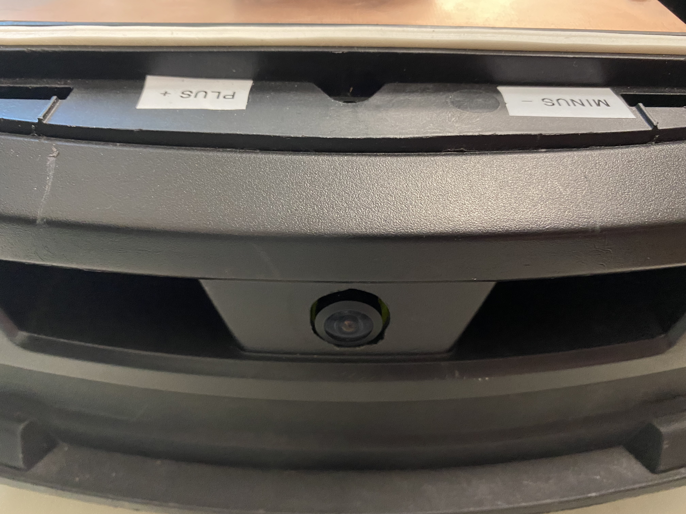
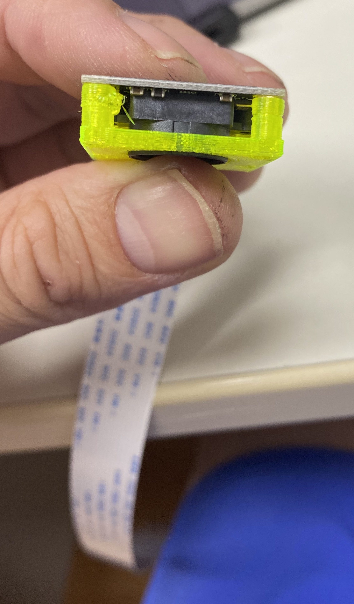
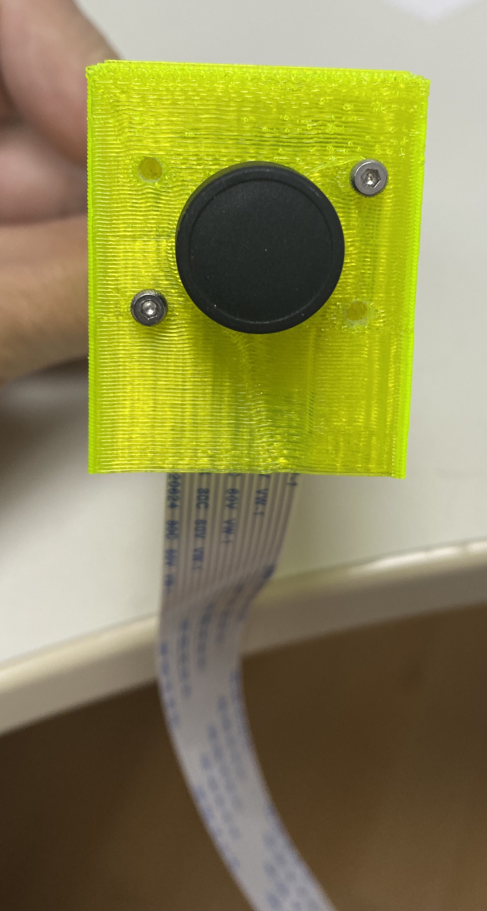
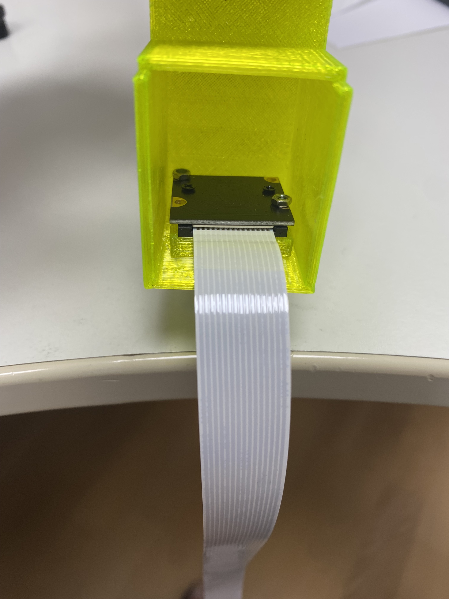
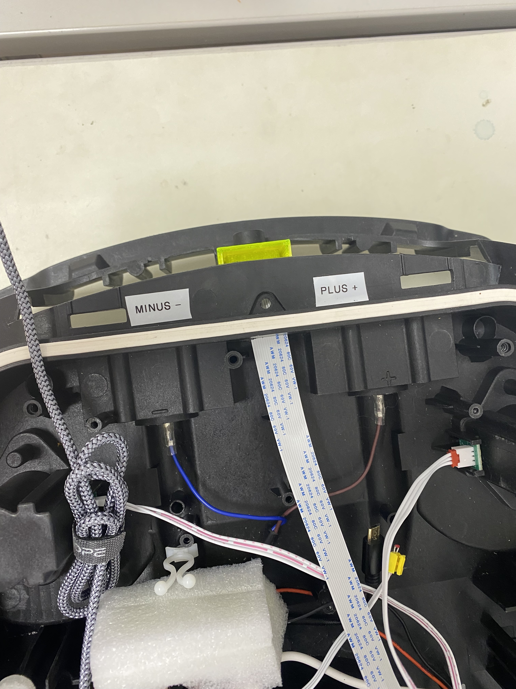

## Cam mount

## Assembly

Used camera was: https://www.amazon.com/SainSmart-Fish-Eye-Camera-Raspberry-Arduino/dp/B00N1YJKFS

(For an alternative mount for bigger cam modules see [here](../Cam%20alternative/))

You will need a dreml to slit the case to allow the flat flex to pass through and a 14mm drill

Note that you can remove the whole insert to make drilling and assembly easier.

* Mount cam in insert

* Mount insert in mount

* Make slit with dremel for flatflex
* Route flatflex to raspi

