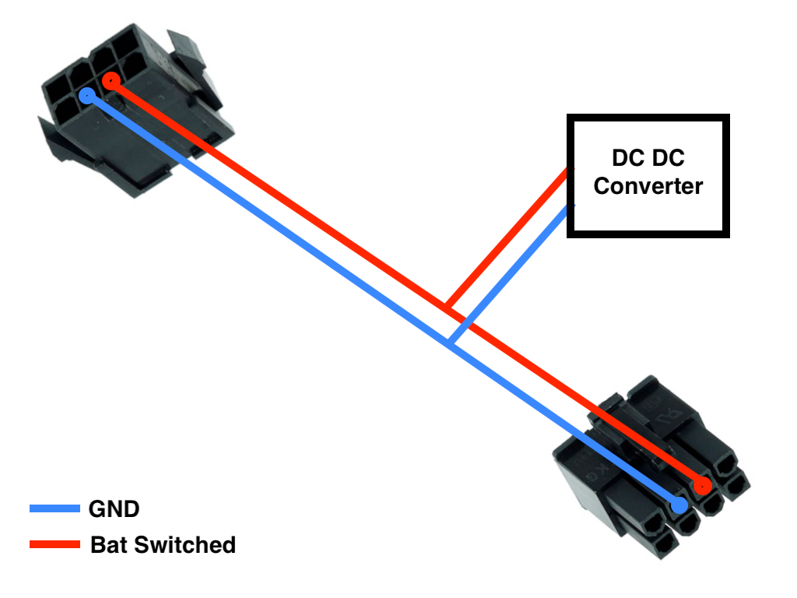

### DCDC Converter wiring

Use an 8 pin ATX extension and wire as follows:

This will provide switched (ext main power switch) 32V for your DCDC converter

### DCDC Converter mounting

The carrier sits atop one of the unused posts.
Note: i have seen versions of the chassis moulding that dont have that post, in that case we just soldered the wires and shrink wrapped the whole DCDC Converter.

Note: i removed the USB connector (on the DCDC) and soldered the wires directly, at least the cheap chinese USB A sockets are not suitable for a moving robot platform - the raspi was constantly glitching with undervoltage.

