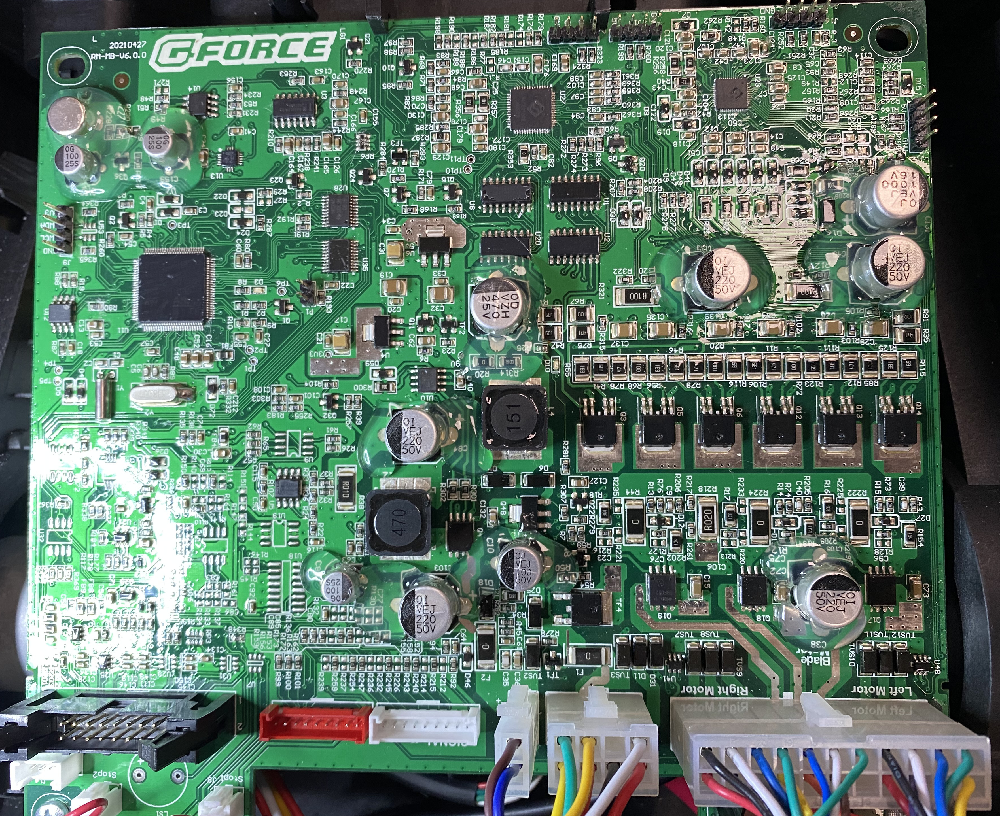

# Mowgli

## About

This repo tracks my progress in reverse engineering the Yardforce GForce mainbord as used in the Yardforce 500 (and others) Mower Robots.

In the end in would like to use it with [OpenMower](https://github.com/ClemensElflein/OpenMower) but without having to use that projects mainboard, instead recycling as much hardware as possible from the original GForce mainboard. 
There should be no irreversible modifications to the GForce board required.

## Looking for MowgliRover ?

see [here](https://github.com/cloudn1ne/MowgliRover)

## Updates

see [Updates](UPDATES.md)

## Safety
<table border=1>
   <tr>
      <td>
The custom firmware has no protections - no tilt sensing, no stop buttons will work. If you stick your finger in the wrong place, you will lose it.

         <ul>
<li>Remove the razor blades
<li>Dont be stupid
<li> Dont blame me for your lost finger
         </ul>
      </td>
      <td>
         
      </td>
   </tr>
</table>

## Whats done ?

- [Basic overview of the mainboard](./Kicad), [Datasheets](./Datasheets) for ICs
- Motor Drivers for both Drive Motors and Blade Motor can be controlled
- Mainboard (GForce) Firmware [dump and restore](./stm32/mainboard_firmware) via an ST Link or other (e.g. JLink Segger) tools
- Panel (GForce) Firmware [dump and restore](./stm32/panel_firmware) via an ST Link or other (e.g. JLink Segger) tools
- [Demo Python code](./playground/) to control the Mower via a Joystick (needs "test_code" STM32 code flashed)
- [ROS Serial node](./stm32/ros_usbnode) via CDC USB Port with full hardware support
- Serial debugging on the unused (red) J18 header
- Software I2C on the unusued (red) J18 header - used for external IMU
- [Raspi, IMU, GPS Mounting Options](./Mounting)
- onboard Buzzer
- onboard IMU (accelerometer) for tilt protection
- Safety switches (Hall Sensors) for STOP button
- Rain Sensor

## TODO

- Move all UART functions use DMA as HAL_IT is a seriously broken API
- Publish Blade Motor state

## rosserial node

- [See here how to use the ROS serial node](stm32/ros_usbnode)

## Published Topics

- /mowgli/status - Mowgli Status messages, simliar to Openmowers
- /mowgli/odom - Mowgli ODOM (calculated onboard from wheel ticks)
- /imu/data_raw - Mowgli IMU (the I2C attached one)
- /imu_onboard/data_raw - Mowlgi (on YF Mainboard) IMU accelerometer only
- /imu/mag_calibration - Mowgli IMU (the I2C attached on) - raw magnetometer data (uncalibrated)
- /buttonstates - on supported panels

### in case a supported I2C IMU is connected to J18

Currently only the [Pololu IMU 10v5](https://www.pololu.com/product/2739) is supported, but any I2C or SPI IMU should work.

## Servoces
- /mowgli_cmd/MowerControlSrv - enabled/disable blade
- /mowgli/GetCfg - read SPI flash config var
- /mowgli/SetCfg - write SPI flash config var
- /mowgli/Reboot - reboot Mowgli

## Subscribers
- /cmd_vel - geometry_msgs::Twist (compatible with teleop twist messages, so you can drive the bot)

## Serial Debugging

[Serial Debug for ros_usbnode](stm32/ros_usbnode#serial_debug)

