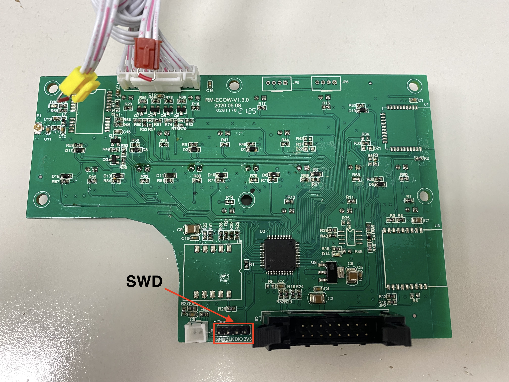

# Preqrequisites

ST Link, 4 spare pin headers, soldering iron and OpenOCD

# Firmware restore (ST Link)

Edit the restore.sh script, and update the filename to whatever your backup is called and run it.

## Locating the connector

There is a 4-pin connector on the board (JP3) - it has silkscreen that is labeled with GND, CLK, DIO, 3V3 pins.

## Backing up the firmware yourself (ST Link + openocd)

run the backup_firmware.sh script

## Backing up the firmware yourself (JLink Segger + openocd)

Reference: https://medium.com/techmaker/reverse-engineering-stm32-firmware-578d53e79b3

(Assuming linux)

This step is easier with an interactive session because the length of your flash may be different per board

Start the openocd session. For j-link (and clones) 

    sudo openocd -c "adapter driver jlink" -c "adapter speed 2000" -c "transport select swd" -f "target/stm32f3x.cfg" 

Connect to the openocd session in a new terminal window

    telnet 127.0.0.1 4444

In that prompt try running these commands to connect to halt+reset it

    init 
    reset init

List flash banks available on the board - there should be one (size 0x00010000) (64k)

    flash banks 

Read the firmware and save it to firmware_panel.bin, use the size you got from the previous step 

    flash read bank 0 firmware_panel.bin 0 0x00010000

Exit the session

    exit

Now you should have a firmware_panel.bin file in the CWD you ran the openocd daemon

