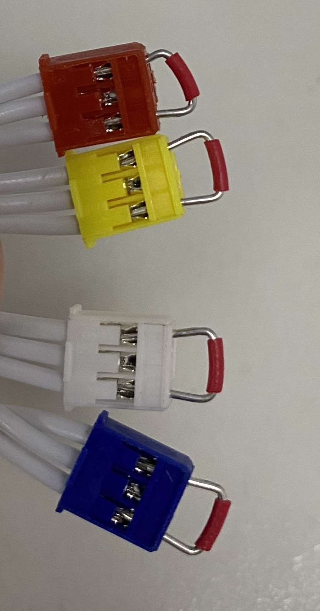

# Howto

## Make sure you have a backup of your stock firmware

[Check here how to do that ...](../mainboard_firmware), only then continue.

## Platform.IO - compile and upload

- Start VS Code and open the project in platform.io.
- Make sure you Build and Upload from the "Yardforce 500(STM32F103 VCT6)" folder - the generic STM32F103C8 folder is for a bluepill test board only.
- Having your ST-Link hooked up to the J9 connector on the mainboard the firmware should now be flashed
- The LED (D3) near the STM32 cpu should flash and you should hear a "double" chirp on bootup

## Hardware

- REMOVE THE BLADES !!! (you have been warned)
- Either use a A<->A USB cable or solder up an USB A cable + connector to J14 pin on the mainboard. You need to connect your YF500 mainboard with your Raspi via USB.
- The panel  (J6) must be plugged in as the switches are hardwired to the motor controllers, if they not shorted you will not be able to start the blade motor.
- Brigde all 4 switch cables coming off the panel board (JP4 connector) by shorting the outer pins, emulating a "ok" condition.


## ROS serial node

- Follow one of the [tutorials on howto install ROS noetic](https://x-tech.online/2022/01/installing-ros-noetic-on-a-headless-raspberry-pi-4-with-ubuntu-20-04/) - i used a Ubuntu 20.04 on a Raspi4 (also works with a Raspi3)
- After having installed the ROS noetic stack you need to add the following packages that allow you to talk to and drive the bot
```
sudo apt-get install ros-noetic-rosserial
sudo apt-get install ros-noetic-teleop-twist-keyboard
```
- Start roscore in your terminal which should look simliar to:
```
roscore
... logging to /home/ubuntu/.ros/log/ac4baa2e-e03d-11ec-a9e3-77e7d5aa8a2a/roslaunch-ubuntu-1914.log
Checking log directory for disk usage. This may take a while.
Press Ctrl-C to interrupt
Done checking log file disk usage. Usage is <1GB.

started roslaunch server http://127.0.0.1:35301/
ros_comm version 1.15.14


SUMMARY
========

PARAMETERS
 * /rosdistro: noetic
 * /rosversion: 1.15.14

NODES

auto-starting new master
process[master]: started with pid [1924]
ROS_MASTER_URI=http://127.0.0.1:11311/

setting /run_id to ac4baa2e-e03d-11ec-a9e3-77e7d5aa8a2a
process[rosout-1]: started with pid [1934]
started core service [/rosout]
````

- Next plug your USB Cable into the Raspi on end and the GForce mainboard on the other, and turn on the bot.
 (note the Raspi will power up the mainbord, but you need the battery on to do drive it actually)

- Open a second terminal to your Raspi and run:

```
lsusb
```
  You should see a serial port discovered that looks simliar to:
 
```
  Bus 001 Device 038: ID 0483:5740 STMicroelectronics Virtual COM Port
```
  Figure out which tty device this is with something like:
  
```
dmesg | grep -2 STM |tail -5
[10950.671675] usb 1-1.3: New USB device strings: Mfr=1, Product=2, SerialNumber=3
[10950.671687] usb 1-1.3: Product: Mowgli
[10950.671698] usb 1-1.3: Manufacturer: STMicroelectronics
[10950.671708] usb 1-1.3: SerialNumber: 5CF8673F3430
[10950.676549] cdc_acm 1-1.3:1.0: ttyACM0: USB ACM device
```
  In this example it is /dev/ttyACM0, so run:
  
``` 
rosrun rosserial_python serial_node.py _port:=/dev/ttyACM0 _baud:=115200
[INFO] [1653942964.974184]: ROS Serial Python Node
[INFO] [1653942964.992384]: Connecting to /dev/ttyACM0 at 115200 baud
[INFO] [1653942967.104468]: Requesting topics...
[INFO] [1653942967.211183]: Note: publish buffer size is 1024 bytes
[INFO] [1653942967.214626]: Setup publisher on /tf [tf/tfMessage]
[INFO] [1653942967.223794]: Setup publisher on battery_voltage [std_msgs/Float32]
[INFO] [1653942967.258762]: Setup publisher on charge_voltage [std_msgs/Float32]
[INFO] [1653942967.269210]: Setup publisher on charge_pwm [std_msgs/Int16]
[INFO] [1653942967.291421]: Setup publisher on odom [nav_msgs/Odometry]
[INFO] [1653942967.300485]: Setup publisher on blade_state [std_msgs/Bool]
[INFO] [1653942967.310584]: Setup publisher on charging_state [std_msgs/Bool]
[INFO] [1653942967.322699]: Note: subscribe buffer size is 512 bytes
[INFO] [1653942967.327584]: Setup subscriber on cmd_vel [geometry_msgs/Twist]
[INFO] [1653942967.340939]: Setup subscriber on cmd_blade_on [std_msgs/Bool]
[INFO] [1653942967.356801]: Setup subscriber on cmd_blade_off [std_msgs/Bool]
[INFO] [1653942967.269210]: Setup publisher on charge_pwm [std_msgs/Int16]
```
 You should see a list of published topics and subscribers
 
 To see if you can talk to the bot via rosserial run something like:
 
```
rostopic echo /battery_voltage
data: 28.841758728027344
---
data: 28.85787582397461
---
^C
````
You should see a new battery voltage reading appear every second.

## Note

The raspi USB stack is not happy when you flash a new firmware version onto the mainboard and the CDC stack gets reinitialized - either you unplug and replug the USB cable to settle things, or if you rather stay seated like me use the [usbreset](../../usbreset) tool. i have simply added it to shell script so it gets executed every time before rosserial is started.

## Drive the bot

To drive the bot you need yet another console to be able to send the teleop twist messages, which is the package installed above.
roscore, and rosserial needs to be running as well

Run teleop with:

```
rosrun teleop_twist_keyboard teleop_twist_keyboard.py
```

And you should get an interface that looks like

```
Reading from the keyboard  and Publishing to Twist!
---------------------------
Moving around:
   u    i    o
   j    k    l
   m    ,    .

For Holonomic mode (strafing), hold down the shift key:
---------------------------
   U    I    O
   J    K    L
   M    <    >

t : up (+z)
b : down (-z)

anything else : stop

q/z : increase/decrease max speeds by 10%
w/x : increase/decrease only linear speed by 10%
e/c : increase/decrease only angular speed by 10%

CTRL-C to quit

currently:	speed 0.5	turn 1.0

Press 'i' to start moving the bot, 'k' to stop and so on.
```
## Enable UART5 on raspi for serial debugging

add this to /boot/firmware/usercfg.txt

```
dtoverlay=uart5
```

then reboot.

## Serial Debugging

<a id="serial_debug">

Wire your serial adapter (or ESP32, or Raspi) to the serial port on the GForce board.
   
I used the J18 (Red connector on the mainboard) because the connector from J5 (Signal will fit) and i dont need the signal sense board anymore.   
As the pins are unfortunatly in the wrong place on the original J5 connector i used a sharp pick tool to relocate the pins as in the image below.
   

   
When you then flash the ros_usbnode firmware or reboot the board you should see output simliar to
   
```
 * Master USART (debug) initialized
 * LED initialized
 * 24V switched on
 * PAC 5223 out of reset
 * PAC 5210 out of reset
 * I2C(Accelerometer) initialized
 * ADC1 initialized
 * Timer1 (Charge PWM) initialized
 * USB CDC initialized
 * Panel initialized
 * ADC Timers initialized
 * Drive Motors USART initialized
 * Blade Motor USART initialized
 * Master Interrupt enabled
 * Drive Motors Interrupt enabled
 * Panel Interrupt enabled
 * Drive Motors initialized
 * Blade Motor initialized
 * HW Init completed
 * NBT Main timers initialized
 * ROS serial node initialized

 >>> entering main loop ...

 > Chg Voltage: 3.04V | Bat Voltage 28.79V
 > Chg Voltage: 5.05V | Bat Voltage 28.79V
 > Chg Voltage: 7.54V | Bat Voltage 28.80V
 > Chg Voltage: 9.61V | Bat Voltage 28.82V
 ```
   
   
